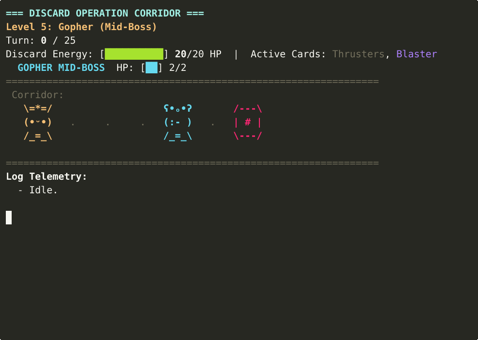

# Discard

> **English** · [Italiano](#italiano)

---

## English

A terminal-based AI programming game written in **Nim**, inspired by *Ruby Warrior*.

You control **Discard** — a semi-forgotten robot representing the lightweight, statically compiled Nim language — cast aside in the scrap archives of **Bloat-Corp**, a digital empire that imposes legacy, bloated languages on all systems. Discard's chassis is covered in literal orange **Rust**, a playful nod to borrow-checker constraints that Nim sidesteps with clean pointers.

To escape, you must write a `playTurn` procedure in Nim that programs Discard's decisions each turn. Navigate 13 progressively harder levels, salvage **Cards** (compiler upgrades and standard library modules), rescue buddy bots, and defeat space-slug bugs — all while learning real Nim features level by level.



### Requirements

- **Nim** ≥ 1.6.0
- `nimble` (comes with Nim)

### Build

```bash
nimble build
```

### Play

Write your AI in `player.nim`, then:

```bash
./discard check            # compile and animate the current level
./discard check --step     # step-debugger mode (Enter per turn)
./discard check --fast     # faster animation
./discard hint             # read level instructions
./discard status           # current level and progress
./discard api              # API cheatsheet for the current level
./discard levels           # roadmap of all levels
./discard next             # advance to the next level (requires cleared)
./discard reset            # reset player.nim to the level template
./discard reset all        # restart from Level 0
./discard select <num>     # jump directly to any level
./discard solve            # load the reference solution
./discard watch            # auto-recompile on player.nim save
```

### Gameplay

Each turn Discard may take **exactly one action** and any number of **senses**:

| Senses (free) | Actions (one per turn) |
|---|---|
| `bot.feel(dir)` → `TileKind` | `bot.walk(dir)` |
| `bot.look(dist, dir)` → `TileKind` | `bot.collect(dir)` |
| `bot.health` / `bot.maxHealth` → `int` | `bot.attack(dir)` |
| `bot.currentScrap()` → `Scrap` | `bot.rest()` |
| | `bot.rescue(dir)` |
| | `bot.shoot(dir)` |

`dir` defaults to `Forward`. `TileKind` helpers: `.isEmpty`, `.isWall`, `.isExit`, `.isItem`, `.isEnemy`, `.isCrew`.

Calling more than one action per turn is a no-op after the first — the API ignores the rest. Reaching the exit (`>`) clears the level; running out of HP or turns fails it.

### On-screen feedback

The animator holds each turn on screen so the action stays readable, and draws what's happening in the arena:

- **Combat FX** — a laser beam (`════►`), a melee clash (`✸✸✸`), or a bite (`✦✦✦`) under the actors.
- **Plasma field** (Levels 7–8) — a `SAFE` / `VENTING` banner; walking on a venting cycle is lethal.
- **Sorting belt** (Level 11) — an "incoming scrap" card showing the item, and a `KEEP` / `DROP` / `JAM!` result under the bot.
- **Score** on clear — turns taken and HP remaining.

Terminals without UTF-8 automatically fall back to ASCII art.

### Level Curriculum

| Level | Name | Nim Concept | Hazard |
|---|---|---|---|
| 0 | Reboot | procedures, imports | — |
| 1 | Scavenger | `let`/`var`, `if`/`else`, enums | — |
| 2 | Pest Control | `case` statement | slug |
| 3 | Low Battery | comparison operators, `bot.health` | slug, low HP |
| 4 | Rescue Mission | UFCS (`a.f(b)`), `.isCrew` | locked exit |
| 5 | Gopher (Mid-Boss) | helper procs, implicit `result` | Gopher mid-boss (2 HP) |
| 6 | Ambush | two-direction logic, `if`/`elif` | slugs front & back |
| 7 | Memory Matrix | persistent `seq` + turn parity | plasma timing field |
| 8 | Corrupted Area | `enum` finite state machine | plasma timing field |
| 9 | Ferris the Crab (Boss) | full API composition | Crab boss (4 HP) |
| 10 | Hidden Minefield | `iterator` / `yield` | live mines (shoot to clear) |
| 11 | Scrap Sorting | object variants, `case` on `kind` | sorting belt (mis-sort jams) |
| 12 | Compile-Time Jammer (Final Gauntlet) | `template` (AST substitution) | 4 regular slugs |

Each level's hazard is enforced by the simulation, not by inspecting your source — the taught concept is the tool you actually need to survive.

### Tests

```bash
nimble test
```

40 unit tests covering the engine, senses, actions, hazards (plasma, mines, sorting belt), and outcomes.

### Project Architecture

```
discard.nim          # CLI (commands, state, dynamic compilation)
player.nim           # active workspace — write your AI here
discard_api.nim      # player-facing API (exported to player.nim)
core/
  types.nim          # Bot, TileKind, Scrap, Equipment, Direction, ...
  engine.nim         # turn-based simulation
  visualizer.nim     # ANSI block renderer + verifyLevel harness
  assets/            # ASCII/Unicode sprites + level registry (levels.txt)
levels/
  NN_name/
    info.md          # level lore and instructions
    template.nim     # starter code scaffolded into player.nim
    verify.nim       # hidden harness that compiles and checks player.nim
    solution.nim     # archived when player advances (via ./discard next)
tests/
  test_engine.nim    # engine unit tests
```

State is persisted in `.discard_state` (current level + solved/unsolved); `.discard_cache` caches the last compile. Delete either to reset; both are git-ignored.

---

## Italiano

Un gioco di programmazione per terminale scritto in **Nim**, ispirato a *Ruby Warrior*.

Controlli **Discard** — un robot semi-dimenticato che rappresenta il linguaggio Nim, leggero e compilato staticamente — abbandonato negli archivi di rottami di **Bloat-Corp**, un impero digitale che impone linguaggi legacy e gonfi su tutti i sistemi. Lo chassis di Discard è ricoperto di **Rust** arancione letterale, un rimando ironico ai vincoli del borrow-checker che Nim aggira con puntatori puliti.

Per fuggire, devi scrivere una procedura `playTurn` in Nim che programma le decisioni di Discard ad ogni turno. Naviga 13 livelli progressivamente più difficili, recupera **Schede** (aggiornamenti del compilatore e moduli della libreria standard), salva droni compagni, e sconfiggi i bug space-slug — imparando le vere caratteristiche di Nim livello dopo livello.

### Requisiti

- **Nim** ≥ 1.6.0
- `nimble` (incluso con Nim)

### Compilazione

```bash
nimble build
```

### Gioco

Scrivi la tua AI in `player.nim`, poi:

```bash
./discard check            # compila e anima il livello corrente
./discard check --step     # modalità step-debugger (Invio per ogni turno)
./discard check --fast     # animazione più veloce
./discard hint             # leggi le istruzioni del livello
./discard status           # livello corrente e progresso
./discard api              # scheda di riferimento API per il livello corrente
./discard levels           # mappa di tutti i livelli
./discard next             # avanza al livello successivo (richiede superamento)
./discard reset            # reimposta player.nim al template del livello
./discard reset all        # ricomincia dal Livello 0
./discard select <num>     # salta direttamente a qualsiasi livello
./discard solve            # carica la soluzione di riferimento
./discard watch            # ricompila automaticamente al salvataggio di player.nim
```

### Meccaniche di gioco

Ogni turno Discard può eseguire **esattamente un'azione** e un numero qualsiasi di **sensori**:

| Sensori (gratuiti) | Azioni (una per turno) |
|---|---|
| `bot.feel(dir)` → `TileKind` | `bot.walk(dir)` |
| `bot.look(dist, dir)` → `TileKind` | `bot.collect(dir)` |
| `bot.health` / `bot.maxHealth` → `int` | `bot.attack(dir)` |
| `bot.currentScrap()` → `Scrap` | `bot.rest()` |
| | `bot.rescue(dir)` |
| | `bot.shoot(dir)` |

`dir` ha valore predefinito `Forward`. Helper di `TileKind`: `.isEmpty`, `.isWall`, `.isExit`, `.isItem`, `.isEnemy`, `.isCrew`.

Chiamare più di un'azione per turno non ha effetto dopo la prima — l'API ignora le successive. Raggiungere l'uscita (`>`) supera il livello; finire gli HP o i turni lo fa fallire.

### Feedback a schermo

L'animatore mantiene ogni turno a schermo abbastanza a lungo da rendere leggibile l'azione, e disegna ciò che accade nell'arena:

- **Effetti di combattimento** — un raggio laser (`════►`), un colpo corpo a corpo (`✸✸✸`) o un morso (`✦✦✦`) sotto i protagonisti.
- **Campo di plasma** (Livelli 7–8) — un indicatore `SAFE` / `VENTING`; camminare durante uno sfiato è letale.
- **Nastro di smistamento** (Livello 11) — una scheda "rottame in arrivo" che mostra l'oggetto, e un risultato `KEEP` / `DROP` / `JAM!` sotto il bot.
- **Punteggio** al superamento — turni impiegati e HP rimasti.

I terminali senza UTF-8 ripiegano automaticamente sull'arte ASCII.

### Curriculum dei Livelli

| Livello | Nome | Concetto Nim | Pericolo |
|---|---|---|---|
| 0 | Reboot | procedure, import | — |
| 1 | Scavenger | `let`/`var`, `if`/`else`, enum | — |
| 2 | Pest Control | istruzione `case` | slug |
| 3 | Low Battery | operatori di confronto, `bot.health` | slug, HP basso |
| 4 | Rescue Mission | UFCS (`a.f(b)`), `.isCrew` | uscita bloccata |
| 5 | Gopher (Mid-Boss) | procedure helper, `result` implicito | Gopher mid-boss (2 HP) |
| 6 | Ambush | logica a due direzioni, `if`/`elif` | slug davanti e dietro |
| 7 | Memory Matrix | `seq` persistente + parità dei turni | campo di plasma |
| 8 | Corrupted Area | macchina a stati con `enum` | campo di plasma |
| 9 | Ferris the Crab (Boss) | composizione completa dell'API | Crab boss (4 HP) |
| 10 | Hidden Minefield | `iterator` / `yield` | mine attive (spara per neutralizzarle) |
| 11 | Scrap Sorting | varianti di oggetti, `case` su `kind` | nastro di smistamento (errore = inceppamento) |
| 12 | Compile-Time Jammer (Gauntlet Finale) | `template` (sostituzione AST) | 4 slug regolari |

Il pericolo di ogni livello è imposto dalla simulazione, non dall'ispezione del codice sorgente — il concetto insegnato è lo strumento che serve davvero per sopravvivere.

### Test

```bash
nimble test
```

40 unit test che coprono motore, sensori, azioni, pericoli (plasma, mine, nastro di smistamento) e risultati.

### Architettura del Progetto

```
discard.nim          # CLI (comandi, stato, compilazione dinamica)
player.nim           # spazio di lavoro attivo — scrivi qui la tua AI
discard_api.nim      # API pubblica esposta a player.nim
core/
  types.nim          # Bot, TileKind, Scrap, Equipment, Direction, ...
  engine.nim         # simulazione a turni
  visualizer.nim     # renderer ANSI a blocchi + harness verifyLevel
  assets/            # sprite ASCII/Unicode + registro livelli (levels.txt)
levels/
  NN_name/
    info.md          # lore e istruzioni del livello
    template.nim     # codice iniziale copiato in player.nim
    verify.nim       # harness nascosto che compila e verifica player.nim
    solution.nim     # archiviato quando il giocatore avanza
tests/
  test_engine.nim    # unit test del motore
```

Lo stato è persistito in `.discard_state` (livello corrente + risolto/non risolto); `.discard_cache` memorizza l'ultima compilazione. Eliminane uno per reimpostare; entrambi sono ignorati da git.
